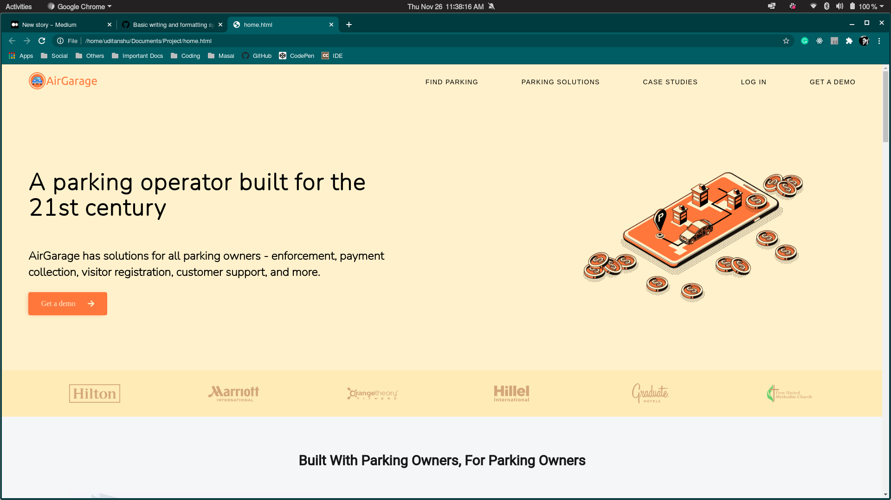
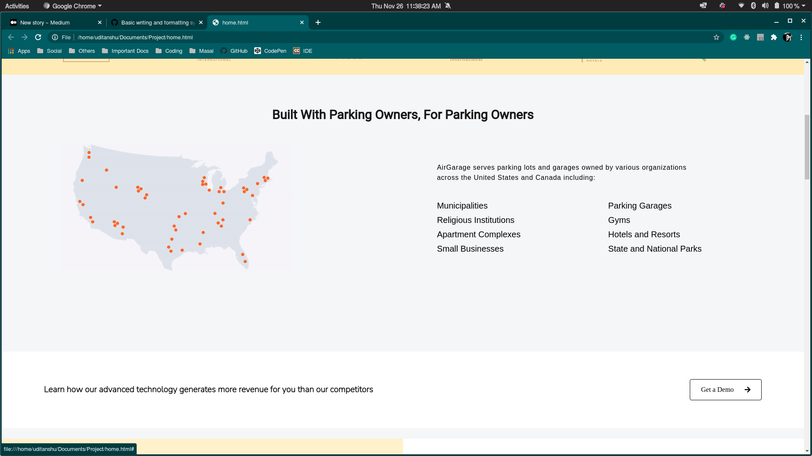
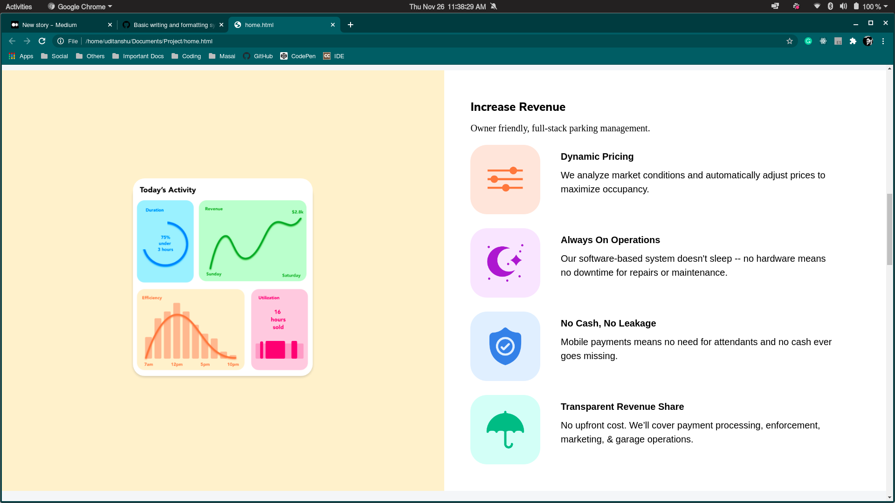
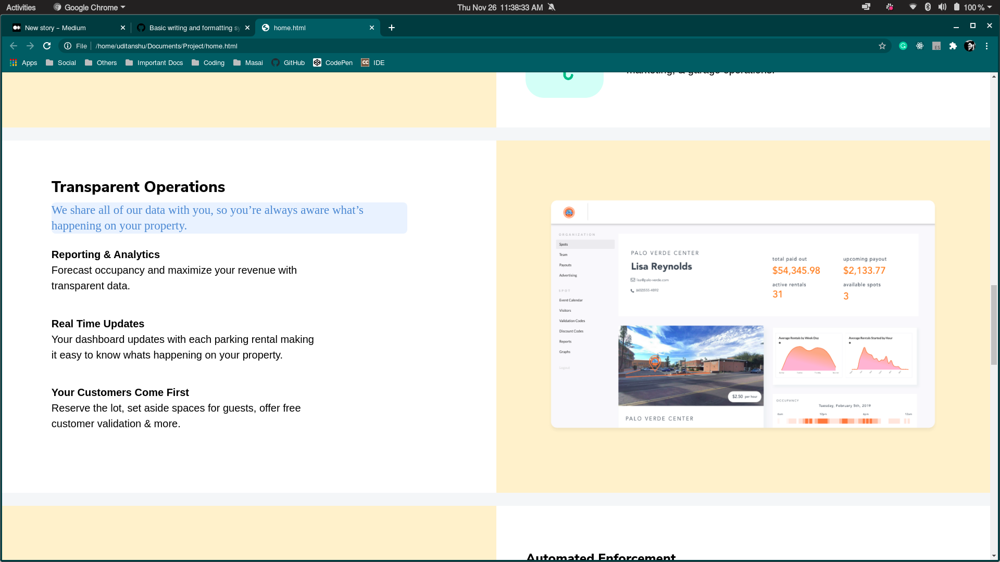
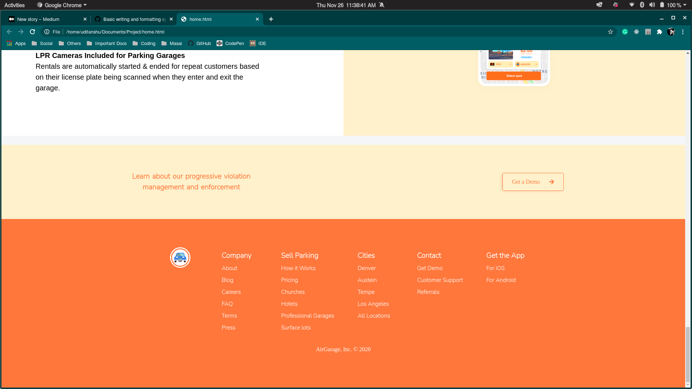
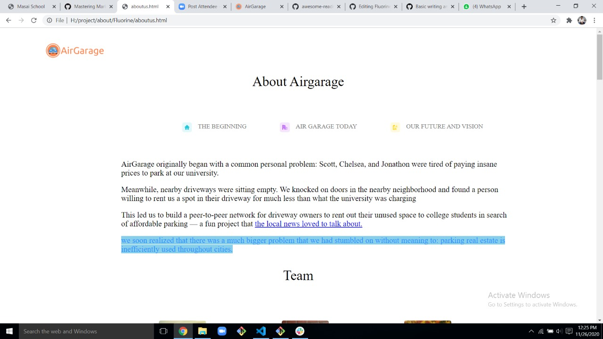

# Fluorine
## Masai Unit 1 project
### This project is created using website of [Air Garage](https://airgara.ge/)
The pages created are
1. Home with sub pages "login" & "submit"
2. About
3. Blog
4. Pricing

To create html elements of this project basic CSS tools are used like **Animations, Flex, Grid etc along with some javascripts**

**The main aim to create these pages is to make them look similar to original websites's pages as it is a part of our Unit 1 evaluation**

This Project took 3 Days to complete and below is the insight of process and issues faced :

##### **Home Page**

*Header section*

To create the header section mainly I have used flexbox, CSS positions, media queries to make the elements get adjusted according to the screen sizes. The main challenge that I faced was in replacing the navbar with a hamburger icon when the screen size goes below 800px. For resolving that part I have heavily used positions and display property. To add the scale in scale-out animation to the icon present in the header we used CSS animation property.

Here for changing the color, saturation, sepia, contrast, opacity, and brightness of the company partner icons filter property has been used.

*Map and demo section*

 To create the map and demo section we have used flexbox, media queries to make the elements get adjusted according to the screen sizes. Here to display the map we have used a map gif. For the demo section, we have used a button, upon clicking that button user will be diverted to the demo form.
 

*MIddle Section 1*

In this section, flex-box has been used for laying out the elements and media queries for changing the flex-direction of elements according to the screen sizes. For arranging the text we have used flex and used several google fonts for styling the text. On the left side for displaying the image at the center of the left section, we have used justify-content and align-items property.

*MIddle Section 2*

 
In this section, flex-box has been used for laying out the elements and media queries for changing the flex-direction of elements according to the screen sizes. For scaling in and out the icons present on the left-hand side we have used CSS animation property. For changing the font style google fonts are used.

*Footer*

Here mainly anchor tags are used to divert the user to different pages, in case the user wants to shift to a different page. Flexbox has been used here for deciding the positions on different devices of different sections like company, self-parking, Cities Contact, and Get the app that is present in the footer.

##### **About Page**

In this page **javascript** is used to replace different divs containing different text uses of flex and grids are done to place different size images on their respective positions. Issues faced are 
1.***how to fit these images exactly using @media query so that that page work properly on different devices***
2.***appearance and disapperance of divs by clicking different anchor tags***

   
